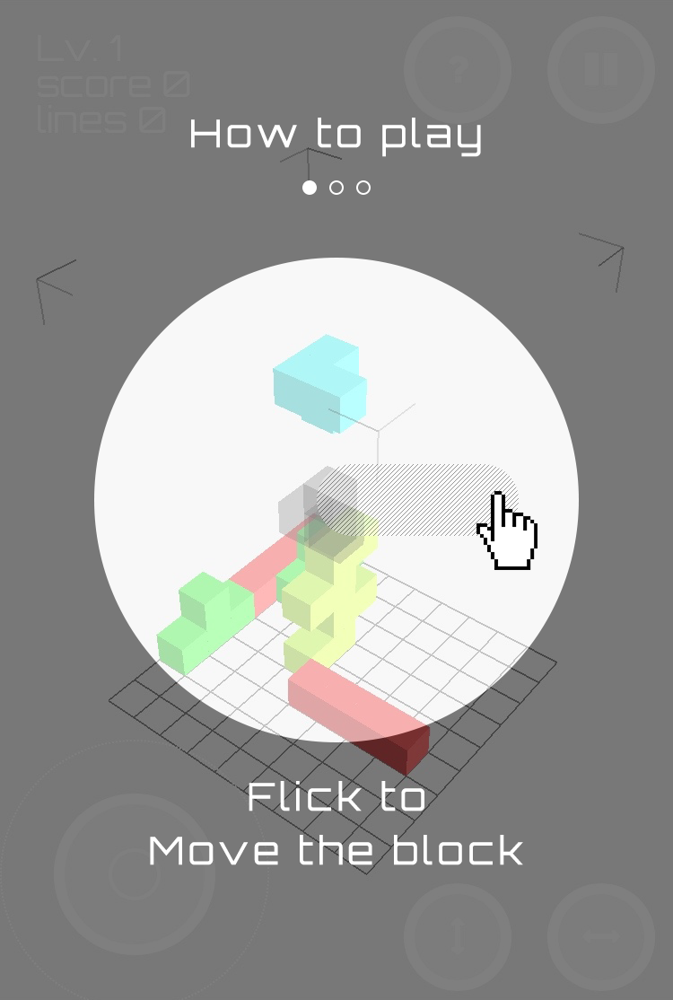
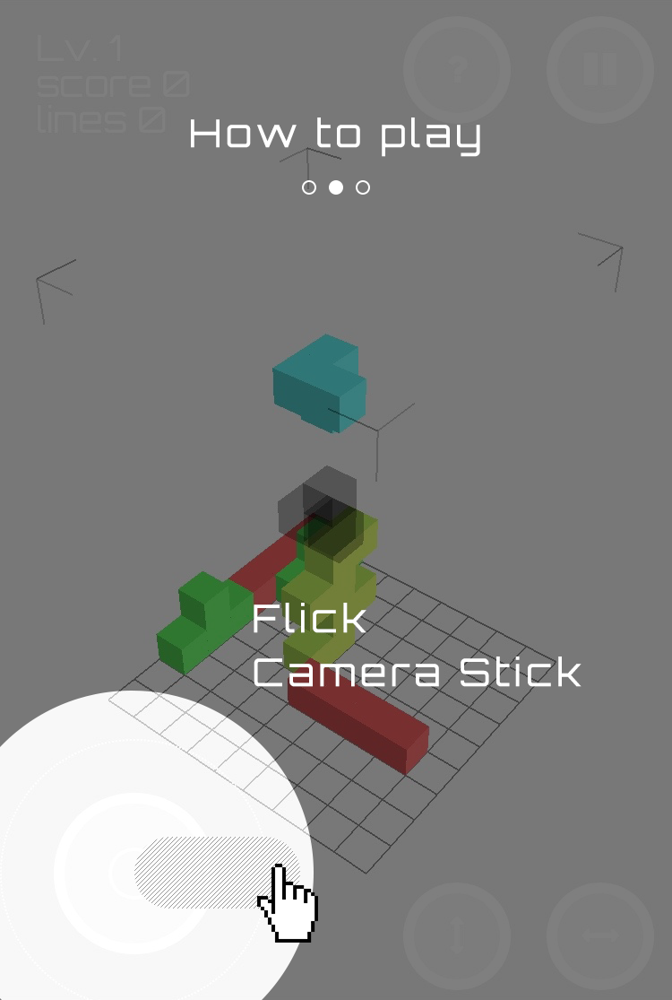
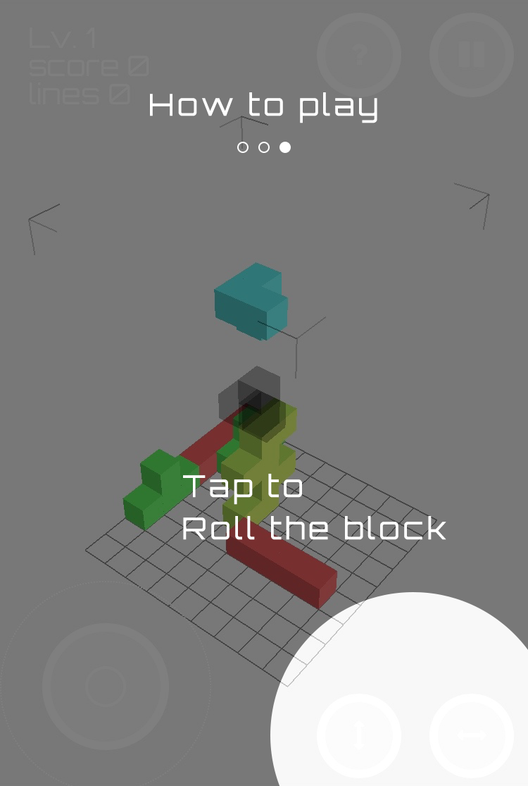

##つくっていいとも増刊号

  2016/05/21 もとき

---

###こんにちは

---

###はじめまして

---

###クライアントワーク事業部
###webフロントエンドエンジニアの
###もときです

---

###新卒2年目です
<!-- 去年の新卒です -->

---

###さて

---

###突然ですが
###みなさん

---

###テトリスって知ってますか？

---

###まあ知らないひとはあんまりいないんじゃないかと思いますが

---

###これですね
<!-- （ロゴ貼る） -->

---

###落ちゲーの元祖と言われるゲームですね

---

<!-- プログラムの世界では、しばしば -->
<!-- 基本の構造が比較的シンプルなことから、 -->
###プログラミングの勉強の題材としてもよく使われています

---

###シンプルで奥が深いゲームです

---

###僕は以前、こんなものをつくりました

---
<!--  ※スクリーンセーバーを実行する  -->
<!-- 
僕は数年前にプログラミングを独学ではじめたのですが
勉強としてテトリスを自分でゼロから作ってみようとしました
#その時は雰囲気だけ良いところまでいったものの、設計がダメすぎて、
ゼロから自分で作るのは1度挫折したんですが
テトリスのプログラムはググればいくらでも出てくるので
既存のコードを元にして、こんなものを作りました
 -->
###テトリス風スクリーンセーバー

<!-- 
スクリーンセーバーなので、pcをしばらく触らずに放置しておいたら起動するんですが
こいつの面白いところは、スクリーンセーバーなのに、操作できるところですね
一列揃えたらちゃんと消えるんですが、
横に長いのでなかなか揃いません

こういう感じのスクリーンセーバーをいくつか作っていて、入社したころに発表したら、あだ名がセイバーになりかけました。あぶなかった。
 -->

<!-- <a href="http://shuuuuun.github.io/TetrisSaver/" target="_blank">http://shuuuuun.github.io/TetrisSaver/</a> -->

---

<!-- ###仕事にもいかされました -->
###仕事にも役立ちました
<!-- これがきっかけで、 -->
<!-- たまたま -->
<!-- 仕事でテトリス風のゲームを作る案件が来たときに、僕に声がかかったりもしました -->
<!-- 仕事でもテトリス風のゲームを作る案件が来て、とても良かったなあと思っています -->

---

###もうみなさんお気づきだと思いますが

---

###ぼく、テトリス好きです。

---

###そこで今日は、新たなテトリスをつくってきました

---

###それが

---

<h1 style="text-align: center;">
  3Dテトリス
</h1>
<!-- 以前社内のいいともでこの名前で発表したんですが
今回はちゃんと名前も考えてきました -->

---

###今回はちゃんと名前も考えてきました

---

###その名も

---

<h1 style="text-align: center;">
  
</h1>
<!-- 
<small>テトリクス</small>
 -->

---

###tetris + cube = tetricus

<!-- --- -->

<!-- ###さらに -->
<!-- ###テトリクスは、 -->
<!-- ###ローマ帝国から独立した、ガリア帝国の皇帝の名前らしいです -->

---

###DEMO
<a href="https://shuuuuun.github.io/3dtetris/" target="_blank">https://shuuuuun.github.io/3dtetris/</a>

---

<!-- howto -->
###操作方法はかんたん！

---

画面上で上下左右にフリックすると、ブロックが動きます

---

左下のカメラスティックを動かせば、視点を移動することが出来ます

---

右下の２つのボタンで、ブロックを回転！

---

###DEMO
<a href="https://shuuuuun.github.io/3dtetris/" target="_blank">https://shuuuuun.github.io/3dtetris/</a>

<!-- ちなみに、まだいくら消してもレベルは上がりません -->

---

####デザインなどは今日デザイナーブースでお話している
####岩瀬さんにお手伝いいただきました！

---

####まだもう少し改良していく予定ですが、
####みなさんぜひ遊んでみてください！

---

###ありがとうございました！

